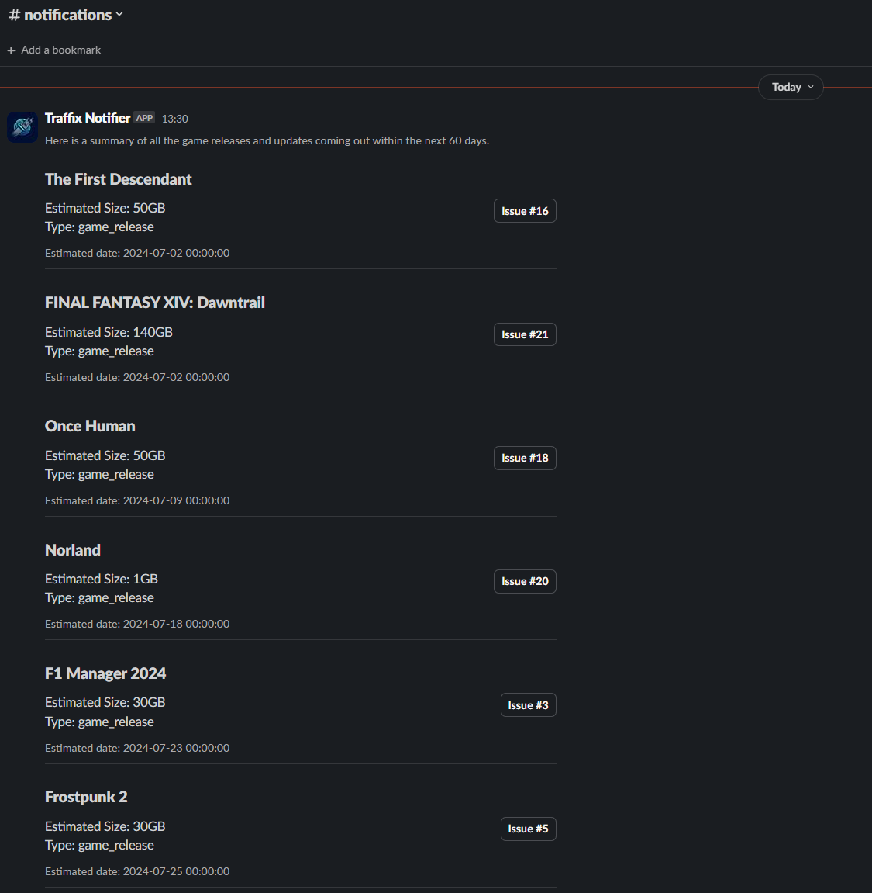

# traffix
Community driven attempt to predict bandwidth utilization throughout the day for major events such as game releases/updates, live entertainment, new films/series, political events, etc...

This project will be split into multiple phases during the development, here is a quick overview of the phases I currently have in mind:

1) Get something out there where people can contribute without depending heavily on manual validation, we can iron out the issues but for now I think just having a place to store names and dates of times where the network will probably be more utilized and see sudden spikes is a good first step.

2) Integrate more than just game releases + updates, for example events like sports, live streaming, new films/series, etc... I think also here we will try to utilize various other methods to injecting the data and not just storing it locally in a yaml file.

3) Integrations with public feeds, the idea here is to build potentially multiple workers (eg. A Steam worker that scrapes the Steam workshop API, and another worker for Microsoft to catch any Windows Updates, etc...), I actually already have a base implementation of a worker (polls Steam workshop API and website similar to SteamDB), the idea is to get it into a state where there is no more manual input (or at least minimum manual input) for new game/updates and other upcoming events, introducing popularity to control the weight (where the event is within the API response/web UI, this will probably just be a path argument in the endpoint to return data in this format, eg. if there is a lot of marketing for a specific game with a lot of social interaction then probably a lot of people will play/download/watch the event)

## Screenshots

## Architecture

## How to contribute a new event

To prevent people randomly injecting false data into traffix, each event is raised as an issue and then approved by the community or an administrator. Use the [issues](https://github.com/veesix-networks/traffix/issues) tab in GitHub and select the correct template when you create an issue, provide the evidence of the event and if an administrator is too slow to approve the request, the community can approve by giving the original issue a 🚀 (rocket) emoji reaction, once it reaches a certain amount of thumbs up then it will automatically be approved (this is set to 10 currently, with administrators/moderators having priority to react and approve the event straight away).

## Future plans

The idea is to have a public API which can be used by the community to scrape the internet and provide bulk events. We would also love to provide an API to all the game distribution platforms in the future for them to send us a request to automatically update our datasources (or at least provide a basic API URL to poll to gather these events to generate graphs and inform the community via automated notifications via different medias like XML feeds, discord chat bots, etc.)
